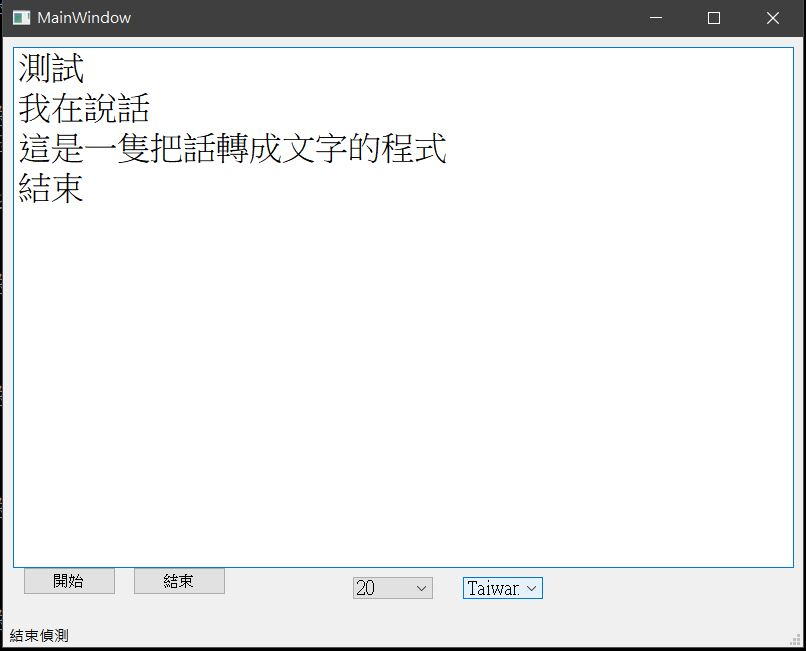

# ShowYourWords
For the hearing impaired. Show what you are talking about.

Translate spoken words to text via Google API.

Now just for Chinese, Japanese and English.

You can get `BCP-47` code in [Google API language support](https://cloud.google.com/speech-to-text/docs/languages) and add it in `languages.json`.

The programe still has some features that can be improved.

When the API translating, programe can't track what are you saying.

I think queue or threading can fix up this issue, but i'm a lazy guy.

